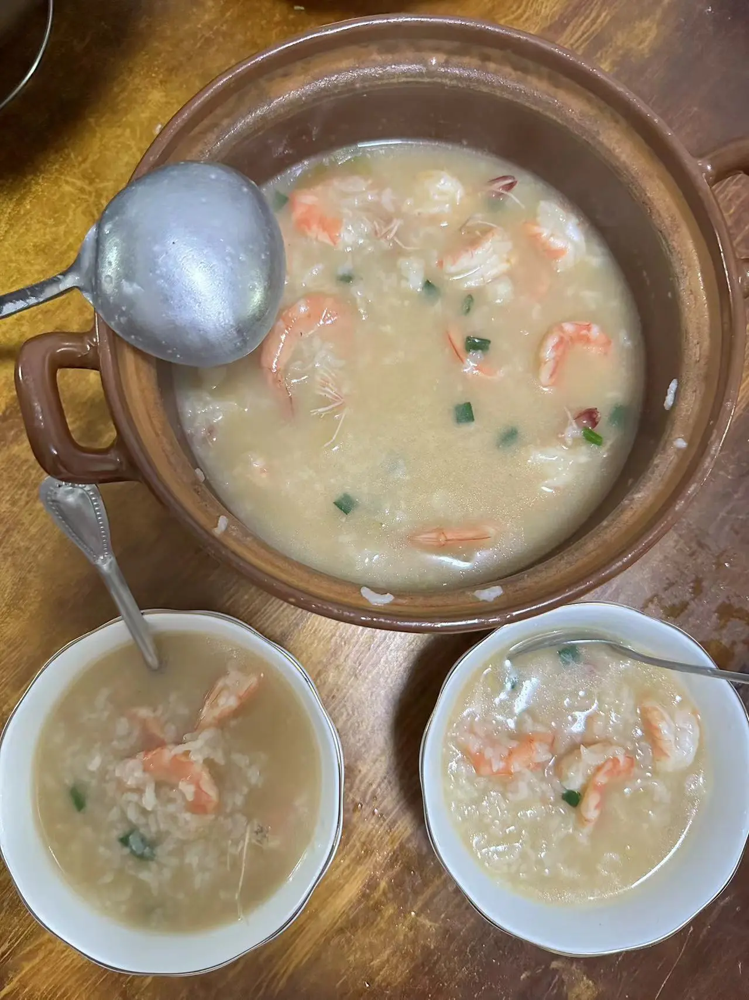

# Tinyo 菜谱

每天进步一点点...

## 海鲜砂锅粥

总结的经验来自于我自己好几次的实验 + 小红书的很多教程，对标的是金稻园的砂锅粥，因为觉得他们煮的真的太好吃的，但是但是，现在我也可以了！

<h4>备菜：</h4>

1. 基围虾 (根据人数来购买，大概3个人一斤虾，虾线去好，虾头放至一边，虾身开好背)
2. 瑶柱干贝都行 (切成小块状)
3. 红头葱、姜、蒜 (葱头、姜、蒜切段，葱花备好)
4. 大米 (提前泡好，1个小时)
5. 花生酱 (3人一勺，根据人数添加)
6. 冬菜 (3人一勺，根据人数添加)
7. 盐、鸡精、胡椒粉

<h4>具体步骤：</h4>

1. 往砂锅中倒入油，下入切好的葱姜蒜(红头葱头)炒一点香后丢入虾头进行翻炒，至到炒出虾油。
2. 倒入煮好的水，盖上锅盖，留一条缝，中火煮5分钟。
3. 捞出所有的配料，倒入瑶柱干贝，大米，盖上锅盖，留一条缝，小火煮20分钟。(10分钟的时候搅拌一下，避免粘锅)
4. 加入盐、鸡精、胡椒粉、花生酱，搅拌至花生酱全部融化。
5. 加入虾身、冬菜，一边煮一边搅拌至虾熟。
6. 最后加入葱花，搞定！！

<h4>其他：</h4>

需要加入其他海鲜的话，例如鲍鱼、生蚝，只需要根据自己的要求清洗干净，在第五步倒入到粥中一起煮即可。不建议太多种类的海鲜，一次最多两种，口感才最好哦！

## 黄金扬州炒饭

<h4>备菜：</h4>

1. 豌豆
2. 玉米粒
3. 萝卜丁
4. 火腿丁
5. 鸡蛋打到碗里，加入盐鸡精酱油调味，打散
6. 米饭 (能隔夜当然最好，不要煮太多水)
7. 盐、鸡精、酱油

<h4>步骤：</h4>

1. 锅中倒入豌豆、玉米粒、萝卜丁、火腿丁，倒入开水覆盖，中大火煮个5分钟后倒出沥干备用。
2. 倒入一点蛋液到米饭中，搅拌一下。锅中加入油，倒入米饭翻炒一下，捞出。
3. 再次加入一次油倒入剩余的蛋液，翻炒一会后将刚刚炒好的饭重新倒入翻炒，捞出备用。
4. 锅中加入油，将沥干的豌豆、玉米粒、萝卜丁、火腿丁倒入锅中大火翻炒，后倒入鸡蛋饭，加入盐鸡精，中火翻炒一会即可(大火炒注意粘锅)。

## 土豆焖鸡

<h4>备菜：</h4>

1. 剁好的鸡块
2. 土豆块
3. 葱花、红头葱头
4. 姜、蒜、料酒
5. 盐、鸡精、生抽、老抽、糖、耗油、胡椒粉

<h4>步骤：</h4>

1. 锅中放入鸡块，倒入冷水，姜、料酒去腥。抄完水后捞出鸡块。
2. 锅中加入油，下入葱头、姜蒜，倒入沥干水分的鸡块，爆炒直至鸡块金黄色。
3. 锅中下入一大勺生抽、蚝油一圈、胡椒粉、老抽(半勺就好上色)、盐一勺、少许鸡精、白糖一勺。炒至颜色一致。
4. 导入土豆块，爆炒一下。
5. 加入开水，没过食材。盖上锅盖焖煮，直至浓稠，下入葱花翻炒一下即可出锅！

